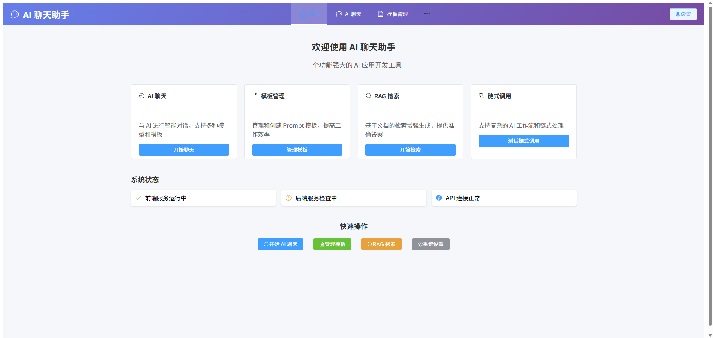
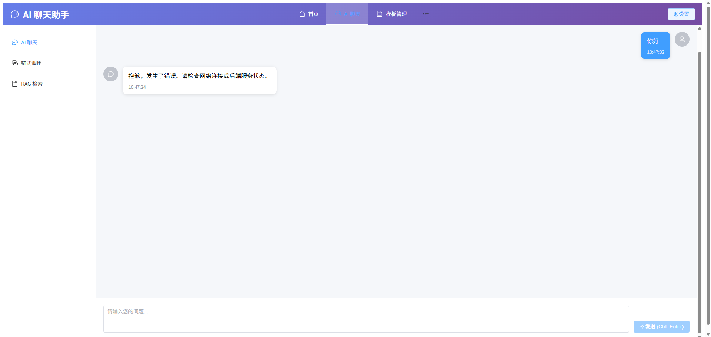
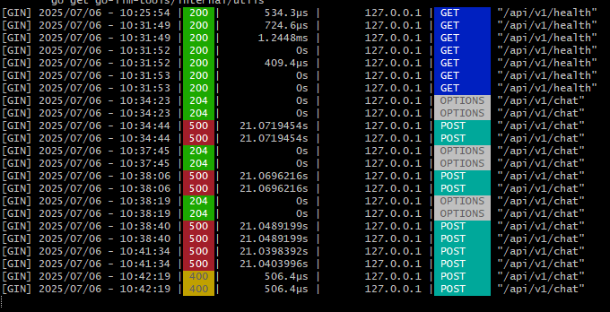

# AI 聊天助手项目

这是一个基于 Go 后端和 Vue3 前端的 AI 应用开发工具，集成了 LangChain、RAG、Prompt Engineering 等功能。








## 项目结构

```
go/
├── api/                    # Go 后端 API 服务
│   └── main.go
├── internal/               # 内部模块
│   ├── chain/             # 链式调用
│   ├── llm/               # LLM 集成
│   ├── prompt/            # Prompt 工程
│   ├── rag/               # RAG 检索增强生成
│   └── utils/             # 工具函数
├── ai-frontend/           # Vue3 前端
│   ├── src/
│   │   ├── views/         # 页面组件
│   │   ├── stores/        # 状态管理
│   │   └── router/        # 路由配置
│   └── package.json
└── README.md
```

## 功能特性

### 🚀 核心功能
- **AI 聊天**: 支持多种 LLM 模型的智能对话
- **模板管理**: 创建和管理 Prompt 模板
- **RAG 检索**: 基于文档的检索增强生成
- **链式调用**: 支持复杂的 AI 工作流

### 🛠️ 技术栈
- **后端**: Go + Gin + OpenAI API
- **前端**: Vue3 + Element Plus + Vite
- **状态管理**: Pinia
- **路由**: Vue Router

## 快速开始

### 1. 环境要求
- Go 1.19+
- Node.js 14+
- OpenAI API Key

### 2. 安装依赖

#### 后端依赖
```bash
# 在项目根目录
go mod tidy
```

#### 前端依赖
```bash
# 进入前端目录
cd ai-frontend
npm install
```

### 3. 配置环境变量

创建 `.env` 文件：
```bash
# 复制环境变量模板
cp env.example .env
```

编辑 `.env` 文件：
```env
OPENAI_API_KEY=your_openai_api_key_here
OPENAI_BASE_URL=https://api.openai.com/v1
```

### 4. 启动服务

#### 方式一：使用启动脚本（推荐）
```bash
# Windows PowerShell
.\start-full.ps1

# 或者使用批处理文件
.\start-full.bat
```

#### 方式二：手动启动

**启动后端服务：**
```bash
# 在项目根目录
go run api/main.go
```

**启动前端服务：**
```bash
# 在 ai-frontend 目录
npm run dev
```

### 5. 访问应用

- **前端界面**: http://localhost:3005
- **后端 API**: http://localhost:8080
- **API 文档**: http://localhost:8080/docs

## 使用说明

### AI 聊天功能
1. 点击导航栏的"AI 聊天"
2. 在输入框中输入问题
3. 选择模型和模板
4. 点击发送或按 Ctrl+Enter

### 模板管理
1. 点击"模板管理"
2. 创建新的 Prompt 模板
3. 设置模板参数和内容
4. 保存并应用到聊天中

### RAG 检索
1. 点击"RAG 检索"
2. 上传文档文件
3. 配置检索参数
4. 基于文档进行问答

## API 接口

### 聊天接口
```
POST /api/v1/chat
Content-Type: application/json

{
  "query": "你的问题",
  "template": "qa",
  "model": "gpt-3.5-turbo"
}
```

### 响应格式
```json
{
  "query": "你的问题",
  "answer": "AI 的回答",
  "template": "qa",
  "model": "gpt-3.5-turbo"
}
```

## 故障排除

### 网络连接问题
如果遇到网络连接错误，请检查：
1. 网络连接是否正常
2. OpenAI API Key 是否正确
3. 防火墙设置是否阻止了连接

### 前端启动问题
如果前端启动失败：
1. 检查 Node.js 版本（建议 16+）
2. 删除 `node_modules` 重新安装
3. 检查端口 3005 是否被占用

### 后端启动问题
如果后端启动失败：
1. 检查 Go 环境是否正确安装
2. 确认 `.env` 文件配置正确
3. 检查端口 8080 是否被占用

## 开发指南

### 添加新的 LLM 模型
1. 在 `internal/llm/` 目录下创建新的模型文件
2. 实现 `LLM` 接口
3. 在配置中添加新模型

### 创建新的 Prompt 模板
1. 在 `internal/prompt/` 目录下添加模板
2. 在前端模板管理界面中创建对应模板
3. 测试模板效果

### 扩展 RAG 功能
1. 在 `internal/rag/` 目录下添加新的检索方法
2. 实现文档处理和向量化
3. 集成到聊天流程中

## 贡献指南

1. Fork 项目
2. 创建功能分支
3. 提交更改
4. 发起 Pull Request

## 许可证

MIT License

## 联系方式

如有问题或建议，请提交 Issue 或联系开发团队。 